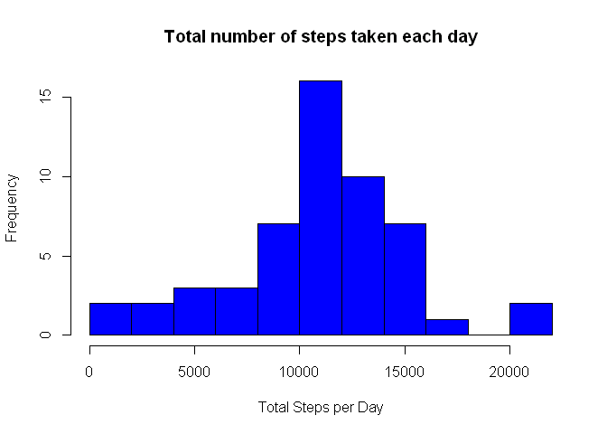
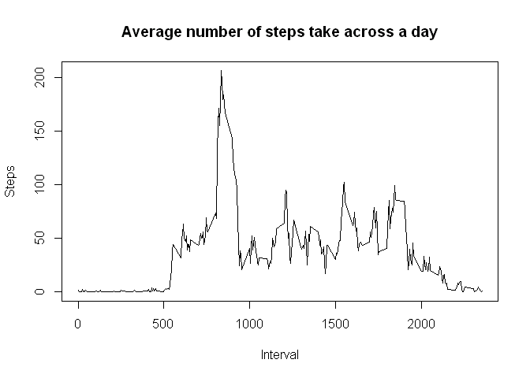
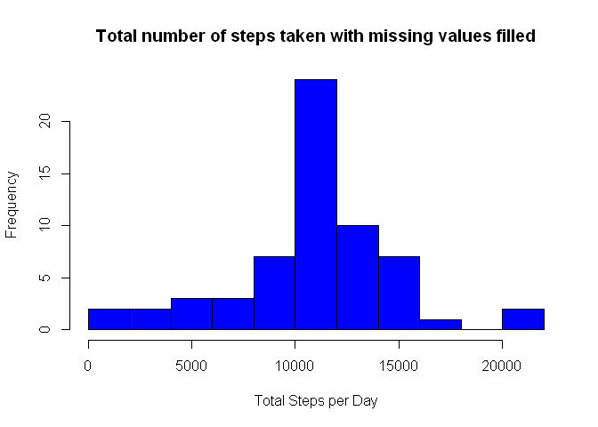
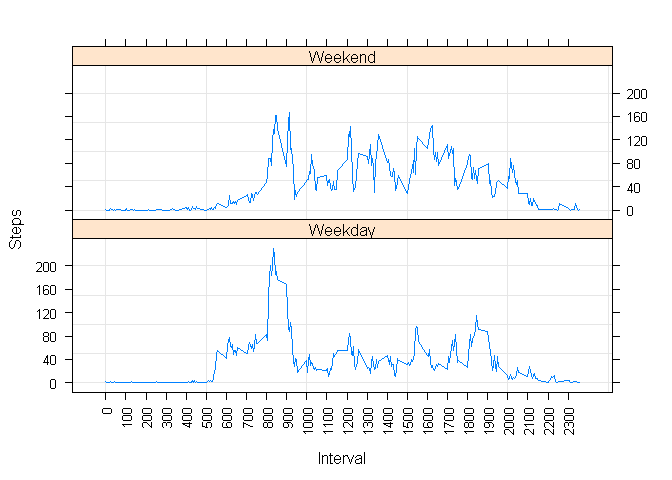

# Reproducible Research: Peer Assessment 1

#Introduction

It is now possible to collect a large amount of data about personal movement using activity monitoring devices such as a Fitbit, Nike Fuelband, or Jawbone Up. These type of devices are part of the "quantified self" movement - a group of enthusiasts who take measurements about themselves regularly to improve their health, to find patterns in their behavior, or because they are tech geeks. But these data remain under-utilized both because the raw data are hard to obtain and there is a lack of statistical methods and software for processing and interpreting the data.

This assignment makes use of data from a personal activity monitoring device. This device collects data at 5 minute intervals through out the day. The data consists of two months of data from an anonymous individual collected during the months of October and November, 2012 and include the number of steps taken in 5 minute intervals each day.
<br>
<br>

#Data

The data for this assignment can be downloaded from the course web site:

* https://d396qusza40orc.cloudfront.net/repdata%2Fdata%2Factivity.zip

The variables included in this dataset are:

* steps: Number of steps taking in a 5-minute interval (missing values are coded as NA)

* date: The date on which the measurement was taken in YYYY-MM-DD format

* interval: Identifier for the 5-minute interval in which measurement was taken

The dataset is stored in a comma-separated-value (CSV) file and there are a total of 17,568 observations in this dataset.
<br>
<br>

## Loading and preprocessing the data


```r
data = read.csv("./activity.csv")
```
<br>
<br>

## What is mean total number of steps taken per day?


```r
#Aggregate steps by date using sum
steps_by_day = aggregate( steps~date, data = data, FUN = sum, na.rm = TRUE)

hist(steps_by_day$steps, col = "blue",
     xlab = "Total Steps per Day",
     main = "Total number of steps taken each day",
     breaks=seq(0,max(steps_by_day["steps"]) + 2000, by=2000)
     )
```

 

```r
mean(steps_by_day$steps)
```

```
## [1] 10766.19
```

```r
median(steps_by_day$steps)
```

```
## [1] 10765
```

The histogram shows the observation of total number of steps taken a day with a of mean of 10766 and a median of 10765.
<br>
<br>

## What is the average daily activity pattern?


```r
#Aggregate steps by interval using mean
steps_by_interval = aggregate( steps~interval, data = data, FUN = "mean", na.rm = TRUE)

plot(steps_by_interval$interval, steps_by_interval$steps,
     type="l", xlab="Interval", ylab = "Steps",
     main = "Average number of steps take across a day")
```

 

```r
max = steps_by_interval[steps_by_interval$steps==max(steps_by_interval$steps),]
```

The graph plots the average number of steps taken in a day, with the maximum number of steps of 206 steps at interval 835.
<br>
<br>

## Imputing missing values

There are a total of 2304 missing values in the dataset. The presence of missing values may introduce bias into some calculations or summaries of the data.

The missing values are filled with the round off mean value at the same interval in the new dataset.


```r
new_data = data

## For each interval
for ( interval in steps_by_interval$interval)
{
        ## Replace the missing values in new dataset with the average value
        new_data[ new_data$interval == interval & is.na(new_data$steps) ,"steps" ] =
        round(steps_by_interval[ steps_by_interval$interval == interval ,"steps" ], 0)
}
```

With the new dataset, the histogram of the total number of steps taken each day was plotted again and the mean and median was recalculated.


```r
#Aggregate steps by date using sum
new_steps_by_day = aggregate( steps~date, data = new_data, FUN = sum, na.rm = TRUE)

hist(new_steps_by_day$steps, col = "blue", xlab = "Total Steps per Day",     
     main = "Total number of steps taken with missing values filled",
     breaks=seq(0, max(new_steps_by_day["steps"]) + 2000, by=2000)
     )
```

 

```r
mean(new_steps_by_day$steps)
```

```
## [1] 10765.64
```

```r
median(new_steps_by_day$steps)
```

```
## [1] 10762
```

We can see that while both graphs has a similiar shape, the graph with missing values filled has a higher maximum frequecy count.

There is only a minor difference in the mean and median value, as shown in the table below.


```
##               mean median
## Original  10766.19  10765
## NA_filled 10765.64  10762
```
<br>
<br>

## Are there differences in activity patterns between weekdays and weekends?
Using the dataset with the filled-in missing values, we explore the difference in activity pattern between weekdays and weenend.

```r
days_data = new_data
# Adding a column day to the data to indicate weekdays.
days_data$days = weekdays(as.Date(days_data$date, format = "%Y-%m-%d"))

days_data[!(days_data$days == "Saturday" | days_data$days == "Sunday"), "days"] = "Weekday"
days_data[(days_data$days == "Saturday" | days_data$days == "Sunday"), "days"] = "Weekend"

#Aggregate steps by interval and days using mean
days_steps_by_interval = aggregate( steps~interval+days, data = days_data, FUN = "mean")

library(lattice)
xyplot(steps~interval|days, data=days_steps_by_interval, type=c("l","g"),
       layout=c(1,2), xlab = "Interval", ylab = "Steps",
       scales=list(x=list(at=seq(0,2359,100),rot=90 ),
                   y=list(at=seq(0,max(days_steps_by_interval["steps"]),40) )
                   )
       )
```

 

We notice that activities on a weekends slowly build up from interval 500 and relativel evenly distributed across the day at about 100 steps.

The weekdays activities has a jump start at interval 500 with another jump at interval 800 and drops at interval 900 and is relatively low at about 50 steps for the rest of the day.
<br>
<br>
<br>
<br>
<br>
<br>
